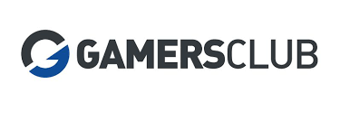
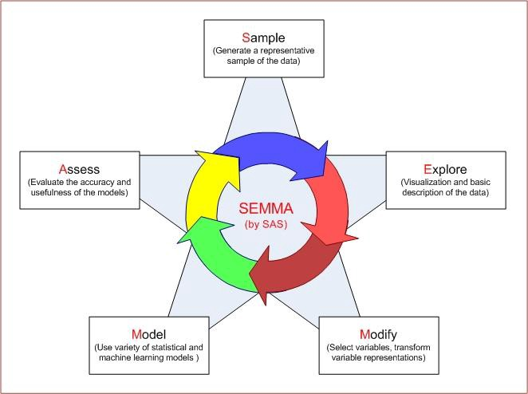
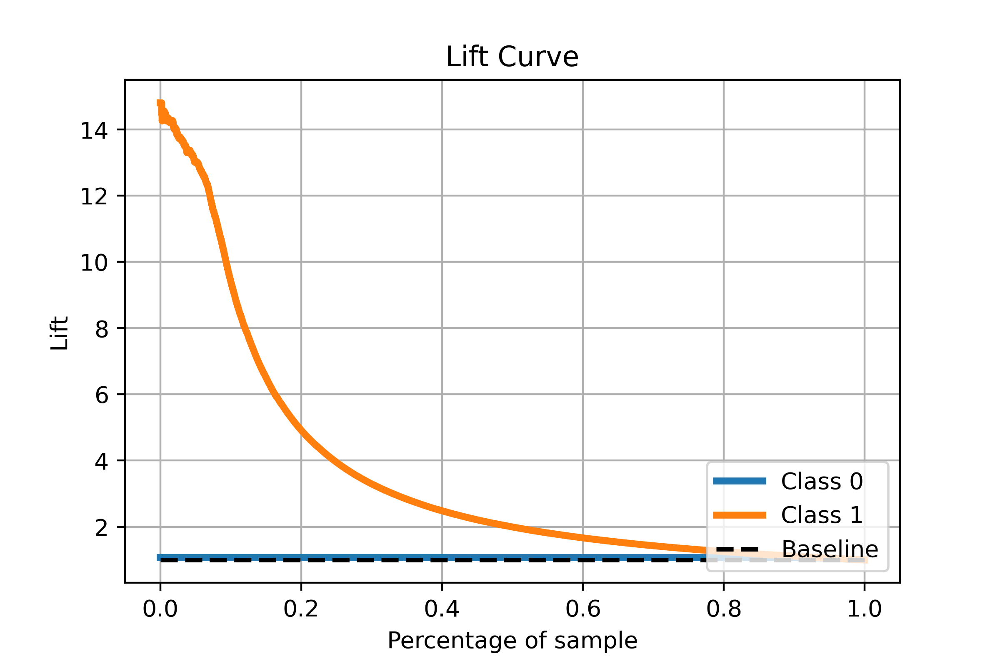

<h1 align='center'> Previsão de Assinaturas da Plataforma Gamers Club</h1>

A finalidade deste projeto é simular toda uma pipeline de um modelo real de negócios, desde a ingestão de dados por um banco de dados, até o deploy de um modelo na cloud com a entrega de um resultado consultado por um usuário. 

O objetivo final do modelo é simular a propensão de um cliente/jogador da plataforma Gamers Club se tornar um assinante pelos próximos 30 dias.

 

## Ferramentas

Durante o projeto, foram utilizadas algumas das seguintes bibliotecas:

- SQLalchemy
- Pandas
- Numpy
- Scikit-learn
- Feature-engine
- Scikit-plot

 

## Dados

Para este projeto utilizaremos dados de partidas que ocorreram nos servidores da Gamers Club. São partidas referentes A 2.500 jogadores, havendo mais de 30 estatísticas de seus partidas. Tais como Abates, Assistências, Mortes, Flash Assist, Head Shot, etc.

Além disso, temos informações de medalhas destes players, como:
- Assinatura Premium, Plus
- Medalhas da Comunidade

Para ter uma melhor descrição destes dados, confira na [página oficial do Kaggle](https://www.kaggle.com/gamersclub/brazilian-csgo-plataform-dataset-by-gamers-club) onde os dados foram disponibilizados.

Abaixo temos o schema (relacionamento) dos nossos dados.

 

## Book de Variáveis

Para uma melhor performance de nosso modelo, foi realizada a criação de um book de variáveis (feature store) e posteriormente criada a nossa variável resposta (target), ou seja, aquilo que queremos prever.

A variável resposta foi feita com base 

 

## ABT

Após nossa criação de variáveis, construimos a tabela para o treinamento do nosso algoritmo. A ABT (Analytical Base Table) ou TAbela Base Analítica é usada para construir modelos analíticos e pontuar o comportamento futuro de um assunto. Um único registro nesta tabela representa o assunto da previsão e armazena todos os dados que descrevem esse assunto.

 

## Modelagem SEMMA

Para realizar a pipeline de nosssa modelagem, foi adotada a metodologia SEMMA (_Sample, Explore, Modify, Model, Asssess_). Ela consiste em uma lista de etapas sequenciais para uma melhor orientação na hora de criar nosso algoritmo.

  

- Amostra: o processo começa com a amostragem de dados, por exemplo, selecionando o conjunto de dados para modelagem. O conjunto de dados deve ser grande o suficiente para conter informações suficientes para recuperar, mas pequeno o suficiente para ser usado de forma eficiente. Essa fase também lida com o particionamento de dados.
- Explorar: esta fase abrange a compreensão dos dados, descobrindo relações antecipadas e imprevistas entre as variáveis, e também anormalidades, com a ajuda da visualização de dados.
- Modificar: esta fase contém métodos para selecionar, criar e transformar variáveis na preparação para modelagem de dados.
- Modelo: na fase Modelo, o foco está na aplicação de várias técnicas de modelagem (mineração de dados) nas variáveis preparadas, a fim de criar modelos que possivelmente forneçam o resultado desejado.
- Avaliar: A última fase é avaliar. A avaliação dos resultados da modelagem mostra a confiabilidade e utilidade dos modelos criados.

Apesar de ser parecida com a CRISP-DM em muitos aspectos, esta metodologia foca principalmente nas tarefas de criação do modelo, deixando as questões de negócio de fora.

 

## Resolução de Negócios ao CEO

Caso sua equipe de marketing tente direcionar um mailing para qualquer tipo de pessoa, sem qualquer tipo de segmentação, ela teria uma conversão de apenas 6% (ou seja, média de conversão aleatória). A partir do uso do modelo, podemos segmentar as primeiras 1.000 pessoas mais propensas a realizar uma assinatura, e assim tendo o dobro de chances (11% de conversão) de converter um jogador a se tornar assinante.

- Forma 1: Com nosso modelo, precisamos abordar apenas 40% do publico OU deixamos de abordar 60% dos clientes (1500 não interessados de 2518), para ter um ganho/convencer de 83% (117/140) do público potencial que podemos converter.

- Forma 2: Deixamos de abordar 60% do público para deixar de trazer apenas 17% potenciais clientes. Evitamos custos desnecessários. Marketing e comunicação muito mais acurado.

## Deploy

Utilizamos a ferramenta de firefly para realizar um deploy local na máquina, onde executamos a query para consultar a data e o ID do player que queremos verificar a probabilidade de assinar.
Poderá ser realizado um deploy futuro em algum servidor da AWS, ou em alguma cloud como Heroku e Render.
